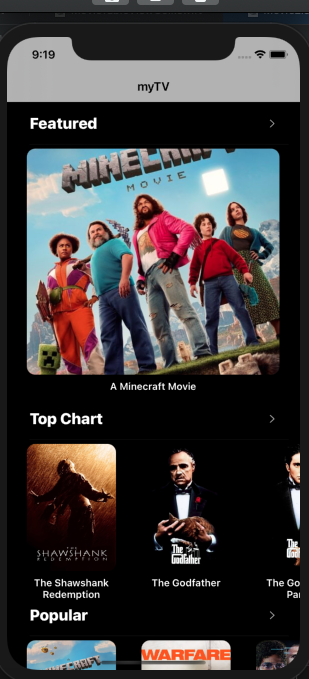
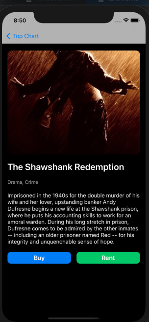
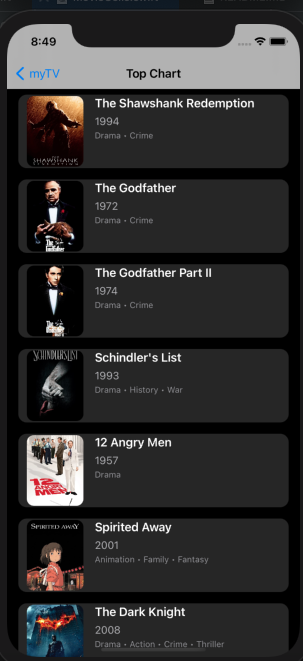

# 🎬 myTV App (iOS)

An elegant iOS app that uses **The Movie Database (TMDB) API** to display trending, featured, and top chart movies in a UI inspired by the Apple TV app. Users can browse movies, view detailed information, with smooth interactions and a modern layout built entirely programmatically (no storyboard!).

---

## 🚀 Features

- 🍿 Featured section with large posters (Apple TV-style)
- 🎞️ Horizontal scrollable sections: Trending, Top Chart, etc.
- 📽️ Movie detail screen with:
  - Poster, title, genre, overview
  - Activity indicator while loading

---

## 🛠️ Tech Stack

- **Language**: Swift 5
- **UI**: UIKit (Programmatic), Auto Layout
- **Networking**: URLSession
- **API**: [TMDB API](https://www.themoviedb.org/documentation/api)
- **Design**: Inspired by Apple TV+

---

## 📁 Project Structure

```
myTV/
├── Controllers/
│   ├── HomeViewController.swift
│   ├── MovieDetailViewController.swift
│   └── MovieListViewController.swift
│   ├── MovieTableViewCell.swift
├── Views/
│   ├── Style.swift
│   ├── UIComponents.swift
│   ├── MovieCells.swift
├── Services/
│   ├── MobileApiService.swift
├── Models/
│   └── Movie.swift
│   ├── GenreManager.swift
├── App/
│   └── SceneDelegate.swift
│   └──  AppDelegate.swift.swift

```

---

## 🧪 Requirements

- Xcode 12+
- iOS 6.0+
- TMDB API Key (Free to get from [TMDB](https://www.themoviedb.org/settings/api))

---

## 🔧 Setup

1. Clone this repo:
   ```bash
   git clone https://github.com/Ezepue/myTV.git
   ```

2. Open the `myTV` in Xcode.

3. Add your TMDB API Key in `MobileApiService.swift`:
   ```swift
   private let apiKey = "YOUR_API_KEY_HERE"
   ```

4. Run the app on a simulator or real device.

---

## 📸 Screenshots

| Home | Detail | Top Chart |
|------|--------|--------|
|  |  |  | 

---

## 🌟 TODO

- [ ] Add genres filtering
- [ ] Movie Trailer
- [ ] Enable infinite scroll
- [ ] Add dark mode support
- [ ] Cache poster images

---

## 🤝 License

This project is licensed under the MIT License.

---

## 👨‍💻 Author

Built with 💙 by [Ezepue Ebuka](https://github.com/Ezepue)

